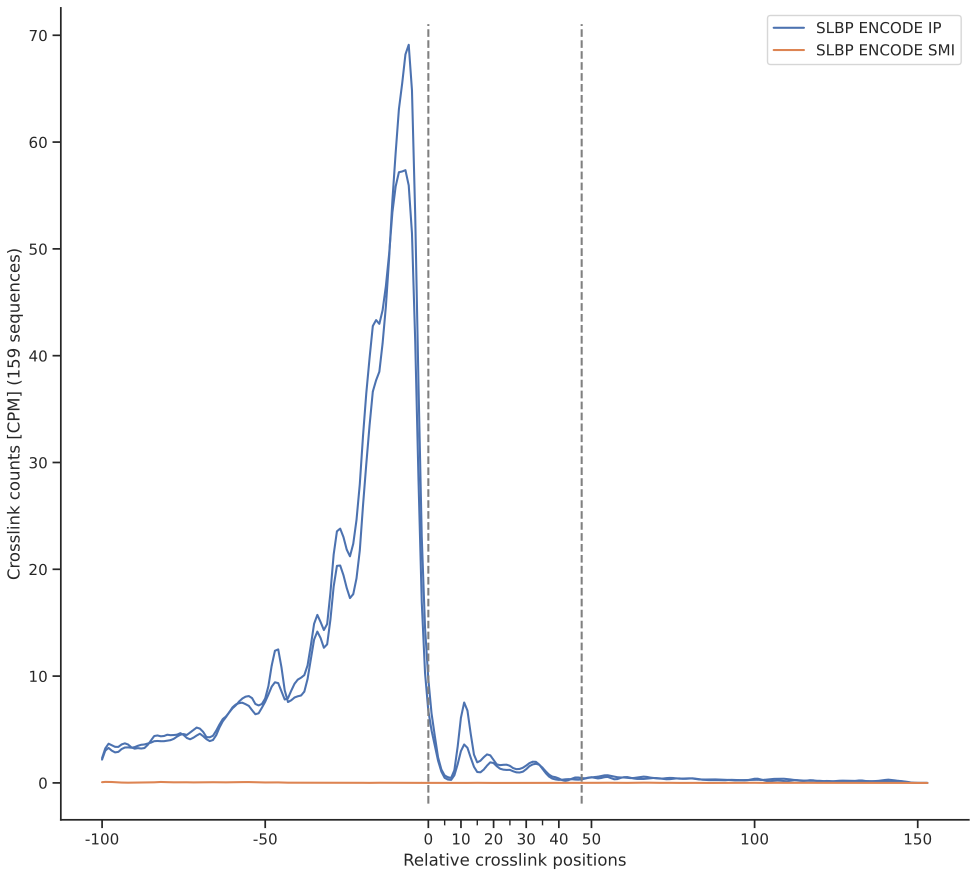
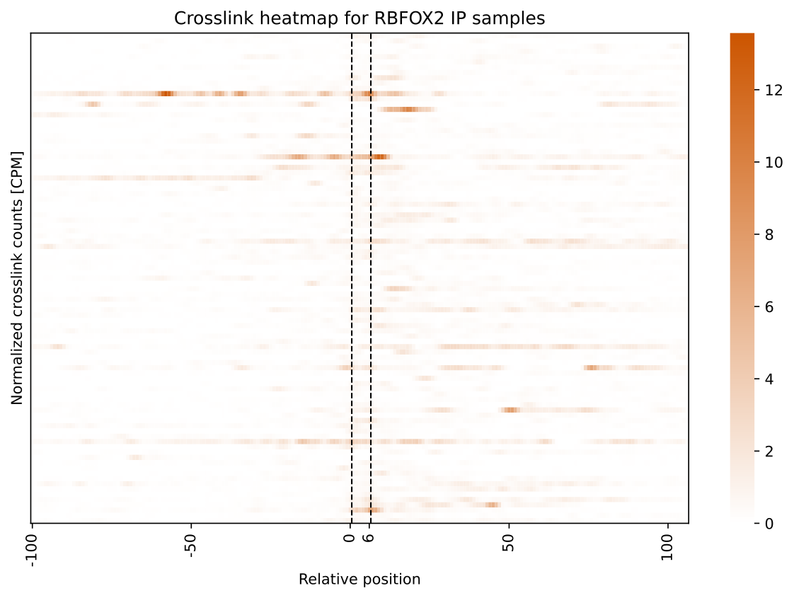

crosslink
---------

Commands under this group takes crosslinking data (.bed) in bed format, either from Shoji or htseq-clip or other similar tools and a bed formatted Region Of Interest (ROI) file as inputs, calculate the crosslink profile over the regions and flank and plot them either as line plots or heatmaps.

.. _csv-ref:
csv-meta-example
^^^^^^^^^^^^^^^^
Print example CSV metadata file for crosslink plotting                                                                                                       

**Usage**

.. code-block:: bash

    ngs-statter csv-meta-example

A format example and additional descriptions will be printed to the console.

count-crosslinks
^^^^^^^^^^^^^^^^

Given a region of interest (ROI) file in bed format and a metadata CSV file (see :ref:`csv-ref`), this command counts the crosslinks that overlap the regions specified in the ROI file.

**Options**

.. csv-table::
    :widths: 10 70 10 10
    :header: "option", "description", "required", "default value" 

    "--metadata", "CSV metadata file specifying crosslinking site files and sample information (see :ref:`csv-ref`)", "|tick|"
    "--bed", "BED file specifying secondary structure/ primary motif regions of interests (supports .gz files)", "|tick|"
    "--out-table","Output file to write the aggregated table (always `.parquet`_ format)", "|tick|"
    "--l","5' extension length for regions in BED file", "|cross|", "100"
    "--r","3' extension length for regions in BED file", "|cross|", "100"
    "--unstranded", "If this flag is set, ignore strand information in the BED file and treat all regions as unstranded", "|cross|"
    "--most-5prime", "If bed regions overlap, only keep the most 5' region out of the overlapping regions", "|cross|"
    "--norm","Normalization method: 'none' or 'cpm'[Counts per million]", "|cross|", "cpm"
    "--sw", "When plotting smooth crosslink sites using moving average. Use these many adjacent bases to compute moving average", "|cross|", 5
    "--tmpdir", "Temporary directory to use (default: system temp folder)", "|cross|"
    "--threads ", "Number of threads to use", "|cross|", 4

**Usage**

.. code-block:: bash

    ngs-statter count-crosslinks --metadata path/to/metadata.csv --bed path/to/roi.bed --out-table path/to/output.parquet --l 100 --r 100 --norm cpm

crosslink-line-plot
^^^^^^^^^^^^^^^^

Given a region of interest (ROI) file in bed format and a metadata CSV file (see :ref:`csv-ref`), count the crosslinks that overlap the regions specified in the ROI file, and plot crosslink profiles as line plots.

**Options**

.. csv-table::
    :widths: 10 70 10 10
    :header: "option", "description", "required", "default value" 

    "--metadata", "CSV metadata file specifying crosslinking site files and sample information (see :ref:`csv-ref`)", "|tick|"
    "--bed", "BED file specifying secondary structure/ primary motif regions of interests (supports .gz files)", "|tick|"
    "--out-table","Output file to write the aggregated table (always `.parquet`_ format)", "|tick|"
    "--l","5' extension length for regions in BED file", "|cross|", "100"
    "--r","3' extension length for regions in BED file", "|cross|", "100"
    "--unstranded", "If this flag is set, ignore strand information in the BED file and treat all regions as unstranded", "|cross|"
    "--most-5prime", "If bed regions overlap, only keep the most 5' region out of the overlapping regions", "|cross|"
    "--norm","Normalization method: 'none' or 'cpm'[Counts per million]", "|cross|", "cpm"
    "--sw", "When plotting smooth crosslink sites using moving average. Use these many adjacent bases to compute moving average", "|cross|", 5
    "--out-fig", "Output file to write the plot (svg/pdf/png)", "|tick|"
    "--fig-width", "Figure width in centimeters", "|cross|", 30
    "--fig-height", "Figure height in centimeters", "|cross|", 27
    "--xlabel", "X axis label for the plot", "|cross|", "Relative crosslink positions"
    "--ylabel", "Y axis label for the plot", "|cross|", "Crosslink counts"
    "--title", "Title for the plot", "|cross|", "Crosslink profile"
    "--ymax", "Maximum value for crosslink counts on y axis (determined from data if not set)", "|cross|"
    "--show-group-mean", "If this flag is set, show the mean crosslink counts for each group", "|cross|"
    "--errorbar", "Error bar to show, see `seaborn errorbar`_ tutorial", "|cross|"
    "--tmpdir", "Temporary directory to use (default: system temp folder)", "|cross|"
    "--threads ", "Number of threads to use", "|cross|", 4

**Usage**

.. code-block:: bash

    ngs-statter crosslink-line-plot --metadata path/to/metadata.csv --bed path/to/roi.bed --out-table path/to/output.parquet --out-fig path/to/output.svg --l 100 --r 100 --norm cpm 

**Example**

crosslink-heatmap
^^^^^^^^^^^^^^^^
Given a region of interest (ROI) file in bed format and a metadata CSV file (see :ref:`csv-ref`), count the crosslinks that overlap the regions specified in the ROI file, and plot crosslink profiles as heatmaps.

**Options**

.. csv-table::
    :widths: 10 70 10 10
    :header: "option", "description", "required", "default value" 

    "--metadata", "CSV metadata file specifying crosslinking site files and sample information (see :ref:`csv-ref`)", "|tick|"
    "--bed", "BED file specifying secondary structure/ primary motif regions of interests (supports .gz files)", "|tick|"
    "--out-table","Output file to write the aggregated table (always `.parquet`_ format)", "|tick|"
    "--l","5' extension length for regions in BED file", "|cross|", "100"
    "--r","3' extension length for regions in BED file", "|cross|", "100"
    "--unstranded", "If this flag is set, ignore strand information in the BED file and treat all regions as unstranded", "|cross|"
    "--most-5prime", "If bed regions overlap, only keep the most 5' region out of the overlapping regions", "|cross|"
    "--norm","Normalization method: 'none' or 'cpm'[Counts per million]", "|cross|", "cpm"
    "--sw", "When plotting smooth crosslink sites using moving average. Use these many adjacent bases to compute moving average", "|cross|", 5
    "--out-dir", "Output directory for plots. Group specific heatmaps will be written to this directory (svg format)", "|tick|"
    "--fig-width", "Figure width in centimeters", "|cross|", 30
    "--fig-height", "Figure height in centimeters", "|cross|", 27
    "--xlabel", "X axis label for the plot", "|cross|", "Relative crosslink positions"
    "--ylabel", "Y axis label for the plot", "|cross|", "Crosslink counts"
    "--vmin", "Minimum value for crosslink counts on y axis (determined from data if not set)", "|cross|"
    "--vmax", "Maximum value for crosslink counts on y axis (determined from data if not set)", "|cross|"
    "--tmpdir", "Temporary directory to use (default: system temp folder)", "|cross|"
    "--threads ", "Number of threads to use", "|cross|", 4

**Usage**

.. code-block:: bash

    ngs-statter crosslink-crosslink-heatmap --metadata path/to/metadata.csv --bed path/to/roi.bed --out-table path/to/output.parquet --out-dir path/to/output_dir --l 100 --r 100 --norm cpm 

**Example**

.. _`.parquet`: https://parquet.apache.org/
.. _`seaborn errorbar`: https://seaborn.pydata.org/tutorial/error_bars.html